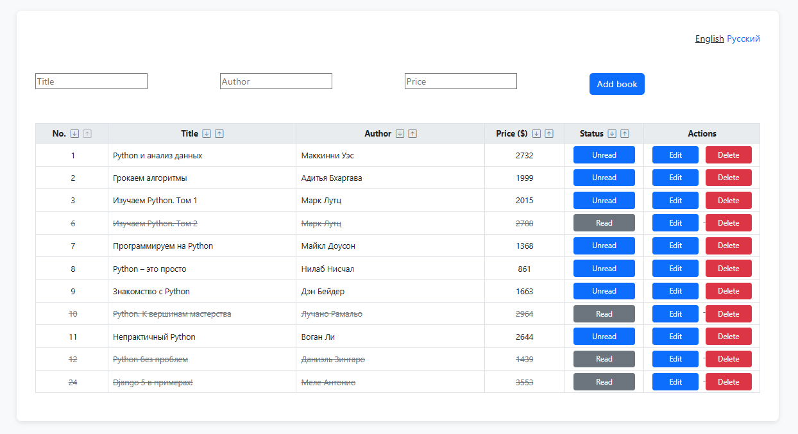

# Django HTMX Book Manager

[](https://python.org)
[](https://djangoproject.com)
[](https://htmx.org)

Простое CRUD-приложение для управления книгами с использованием Django и HTMX, с поддержкой интернационализации и адаптивным дизайном.



## Особенности

- Полный CRUD (Create, Read, Update, Delete) для книг
- Сортировка по различным полям (название, автор, цена и т.д.)
- Интернационализация (i18n) и локализация (l10n)
  - Поддержка русского и английского языков
  - Локализованные URL-адреса
- Интеграция HTMX для динамического интерфейса
- Адаптивный дизайн с Bootstrap 5
- Управление переводами через Django Rosetta

## Технологии

- **Backend**: Django 4.0+
- **Frontend**: 
  - HTMX 1.9+
  - Bootstrap 5
- **Инструменты**:
  - Django Rosetta для управления переводами
  - gettext для локализации

## Установка

### Предварительные требования

- Python 3.8+
- Установленный gettext

#### Установка gettext
- **Linux**:
  ```bash
  sudo apt-get install gettext
- **macOS**:

   ```bash
  brew install gettext
   brew link --force gettext
  
- **Windows**:

    Скачать с официального репозитория:
[link](https://github.com/mlocati/gettext-iconv-windows/releases/download/v0.21-v1.16/gettext0.21-iconv1.16-static-64.exe)

## Шаги установки
1. Клонировать репозиторий:

```bash
git clone https://github.com/daglsn/django_htmx.git
```

2. Создать и активировать виртуальное окружение:

```bash
python -m venv venv
```
```bash
source venv/bin/activate # Linux/macOS
```
```bash
venv\Scripts\activate  # Windows
```

3. Установить зависимости:

```bash
pip install -r requirements.txt
```
4. Настройка БД:

```bash
python manage.py migrate
```
5. Создать суперпользователя:

```bash
python manage.py createsuperuser
```
6. Собрать статику:

```bash
python manage.py collectstatic
```
7. Сгенерировать файлы перевода:

```bash
django-admin makemessages -l ru --ignore=venv
```
```bash
django-admin compilemessages
```
8. Запустить сервер:

```bash
python manage.py runserver
```

